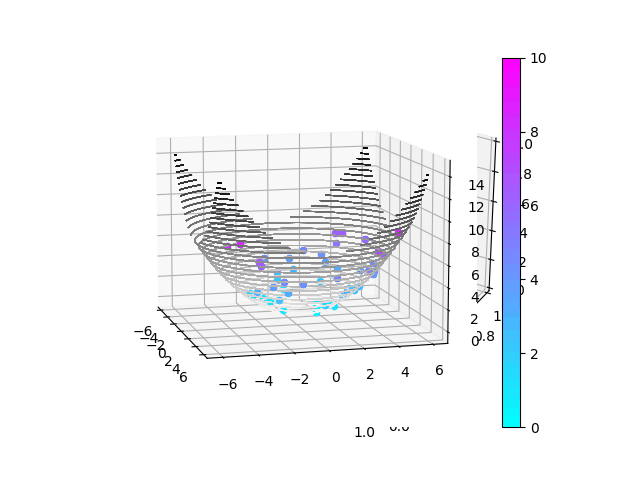

Here is the recent gif generated by my code recently:

This GIF demonstrates a uniformly distributed selection of agents placed onto a polynomial 3D plot. Combining social and cognative weights to optimize as a swarm to the minimum of the given function ((X^2 + Y^2)/5).

Transtioning from 2D to 3D was a challenging but rewarding process getting to see a increased capability of this algorithm to be implemented with another dimension. This visualization can be easily ajusted to new graphs, colormaps, scaling, and more. Soon to come will be increased visual capabilities with new polynomials and enhanced graphics. 

More to come with testing the possibilites of swarm intelligence.

Thank you for your time and the read,
  Drew Sapato
